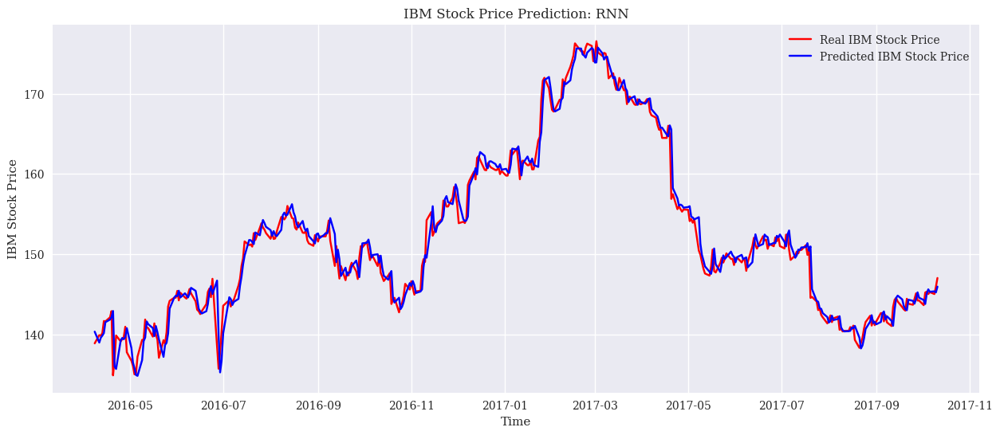
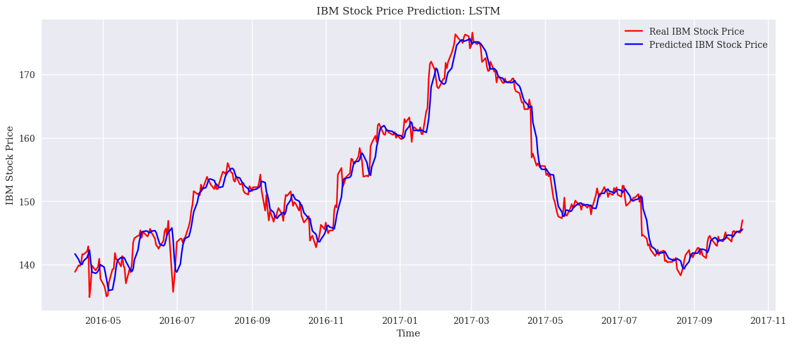
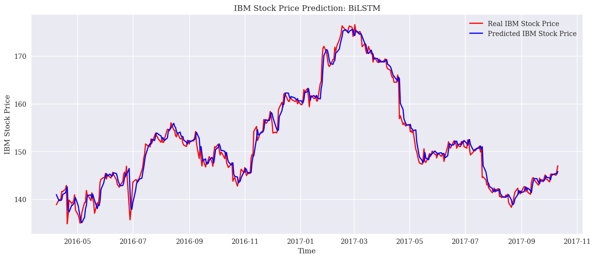

## 实验环境

Intel Core i7-10750H CPU @ 2.60GHz   2.59 GHz

NVIDIA GeForce GTX 1650 Ti

Windows 11, version 21H2

Requirements:

- numpy==1.23.3
- pandas==1.5.1
- torch==1.13.0+cu117
- torchaudio==0.13.0+cu117
- torchvision==0.14.0
- ipykernel==6.19.4
- ipython==8.7.0
- matplotlib==3.6.0
- scikit-learn==1.1.2

## 数据集下载

Huge Stock Market Dataset: Historical daily prices and volumes of all U.S. stocks and ETFs

https://www.kaggle.com/datasets/borismarjanovic/price-volume-data-for-all-us-stocks-etfs

## 运行方式

本次课程设计使用Python语言和CUDA版本PyTorch完成。

代码可使用`Jupyter Notebook`运行。

实验代码和文件：

`predicting-stock-price-using-bilstm-model-pytorch.ipynb`: 基于BiLSTM的股票预测代码
`predicting-stock-price-using-gru-model-pytorch.ipynb`: 基于GRU的股票预测代码
`predicting-stock-price-using-lstm-model-pytorch.ipynb`: 基于LSTM的股票预测代码
`predicting-stock-price-using-rnn-model-pytorch.ipynb`: 基于RNN的股票预测代码
`archive`目录: Huge Stock Market数据集

## 实验结果

RNN:

LSTM:

GRU:

BiLSTM:

